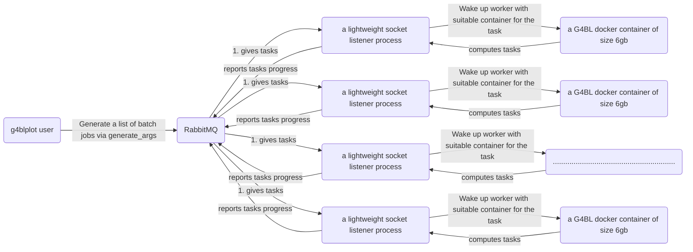

I want to code up a G4BL grid computing system comprising of different computers from different networks.

The system will be run on containers
I have three components:
- g4blplot user : A python script in charge of generating a list of batch jobs via a function
- RabbitMQ (Pika in Python): In charge of distributing the lists of tasks to other computers from different networks (how does it do it, i don't know yet).
- G4BL containers: contains ubuntu 22.04 images and runs computation ([jjasmine/g4fermi:worker on Docker Hub)](https://hub.docker.com/repository/docker/jjasmine/g4fermi/general)

Workflow example: 
- The python scripts calls rabbitmq with a list of batch jobs.
- RabbitMQ distributes tasks of computing 2e9 simulation events to a lightweight listeners/managers.
- Manager starts up workers
- Workers return results of 1 or 0 to manager, manager signalling completion of computation, which returns results to the user.
- User can distribute other round of batch jobs to RabbitMQ, this time for data analysis jobs using python.
- RabbitMQ distributes tasks of analyzing data to workers.
- Worker returns a result that manager will report back to RabbitMQ, which returns to the user.
- If user is satisfied, tell RabbitMQ to send a special task of ID="End session",  which erases all results from that session.

Problems:
- How do I implement a lightweight socket listener?
- When I do implement a socket listener, what security issues should I worry about to ensure that I don't get attacked on my computers because of the listeners?
- What kind of result does worker has to return that allows me to build a framework for users to use this library?
- Data integrity: If data is stored in each computer/node, how do I make sure the data is safe from disk failure / computer failure.

