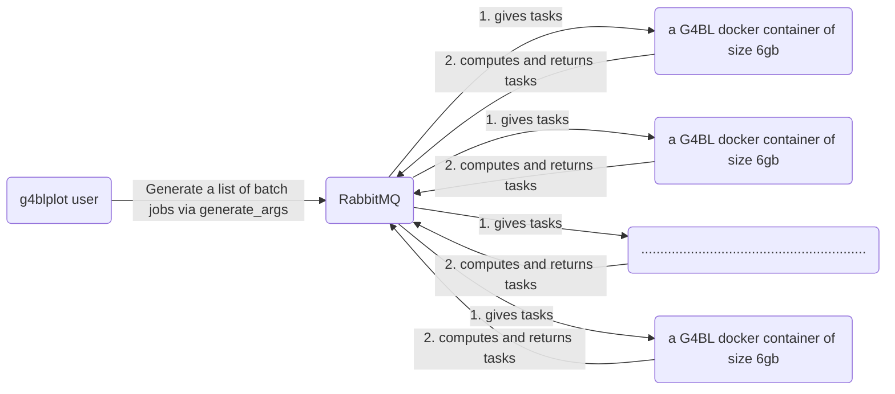

I want to code up a G4BL grid computing system comprising of different computers from different networks.

The system will be run on containers
I have three components:
- g4blplot user : A python script in charge of generating a list of batch jobs via a function
- RabbitMQ (Pika in Python): In charge of distributing the lists of tasks to other computers from different networks (how does it do it, i don't know yet).
- G4BL containers: contains ubuntu 22.04 images and runs computation

Workflow example: 
- The python scripts calls rabbitmq with a list of batch jobs.
- RabbitMQ distributes tasks of computing 2e9 simulation events to workers.
- Workers return results of 1 or 0 to rabbitmq signalling completion of computation, which returns results to the user.
- User can distribute other round of batch jobs to RabbitMQ, this time for data analysis jobs using python.
- RabbitMQ distributes tasks of analyzing data to workers.
- Worker returns a number/ numpy array to RabbitMQ, which returns to the user
- If user is satisfied, tell RabbitMQ to send a special task of ID="End session",  which erases all results from that session.

Problems:
- How do I start a container of workers only when RabbitMQ have a list of tasks to do
- ....

